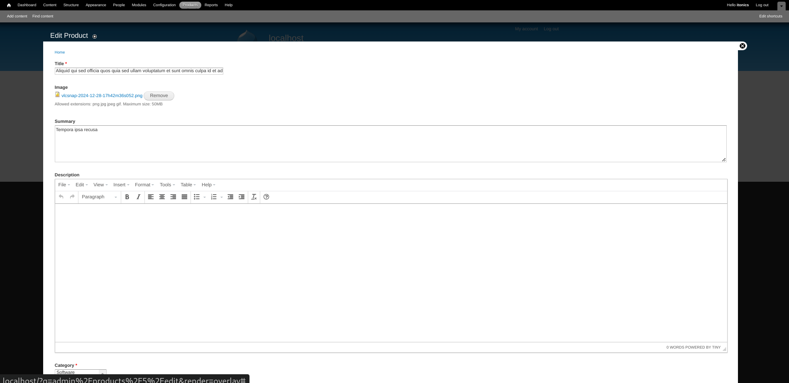
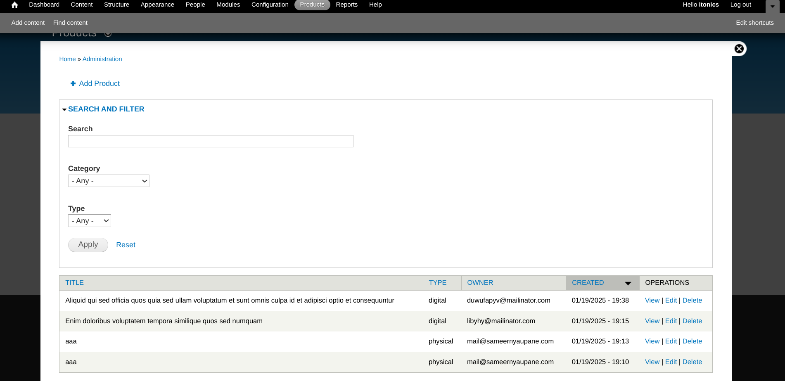

# ITONICS Product Management Module for Drupal 7

A Drupal 7 module for managing products with features like categorization, image management, and rich text descriptions.

## Prerequisites

- Docker
- Docker Compose
- Git

## Installation

1. Clone the repository:
```bash
git clone <repository-url>
cd <repository-name>
```

2. Create environment file:
```bash
cp .env.example .env
```

3. Configure your environment variables in `.env` file with appropriate values for:
- MYSQL_ROOT_PASSWORD
- MYSQL_DATABASE
- MYSQL_USER
- MYSQL_PASSWORD

4. Build and start the containers:
```bash
docker-compose up -d
```

5. Wait for the containers to be ready (this may take a few minutes on first run)

## Initial Drupal Setup

1. Access Drupal installation at `http://localhost`

2. Follow the Drupal installation wizard:
   - Choose "Standard" installation profile
   - Select English (or your preferred language)
   - For database configuration, use:
     - Database name: drupal
     - Database username: drupal
     - Database password: drupal
     - Advanced options > Host: database

3. Complete the site configuration form with your desired admin credentials

## Module Configuration

1. Enable required modules:
   - Go to `admin/modules`
   - Enable the following modules:
     - Date
     - Libraries
     - WYSIWYG
     - Image
     - SameerNyaupane ITONICS Products

2. Configure permissions:
   - Go to `admin/people/permissions`
   - Set appropriate permissions for:
     - Access product administration
     - Create products
     - Edit products
     - Delete products

## Usage

### Managing Products

- Access the product management interface at `admin/products`
- Add new products using the "Add Product" button
- Edit or delete existing products using the operations links
- Use the search and filter options to find specific products

### Product Features

- Image upload with multiple display styles
- Rich text editing for product descriptions
- Multi-select categorization
- Product type classification (Physical/Digital)
- Expiry date management
- Owner email assignment

## Development

### Project Structure

The module is located in:
```
modules/sameernyaupane_itonics_products/
```

Key files:
- `.module` - Main module file with hooks and functions
- `.install` - Database schema and installation hooks
- `css/` - Styling files
- `js/` - JavaScript functionality

### Docker Configuration

The project uses two containers:
- Drupal 7 with Apache (PHP 7.4)
- MySQL 5.7

Relevant configuration files:
- `Dockerfile` - PHP and Drupal configuration
- `docker-compose.yml` - Container orchestration
- `apache-config.conf` - Apache virtual host configuration

## Troubleshooting

1. If the site is not accessible:
```bash
docker-compose ps
docker-compose logs drupal
```

2. For database connection issues:
```bash
docker-compose logs database
```

3. To rebuild containers:
```bash
docker-compose down
docker-compose up -d --build
```

## Screenshots

Here are some screenshots of the product management interface:

### Edit Product Form


### Products List


### Product Detail View

